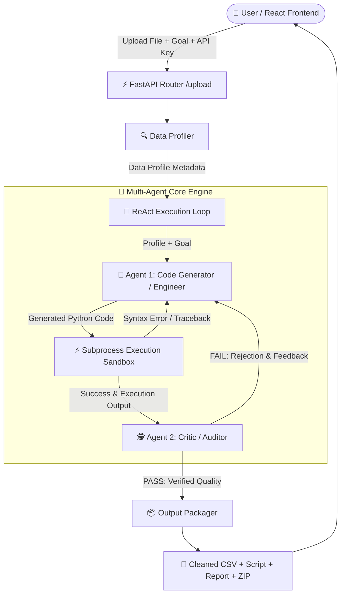

# 🚀 DataPilot-AI

> **Autonomous AI-Powered Data Engineering & Data Science Agent Platform**
> 
> *Upload messy raw datasets, describe your goals in plain English, and receive clean data, executable Python scripts, and executive reports — completely automatically.*

---

## 📌 Executive Summary

**DataPilot-AI** is an autonomous multi-agent platform designed to bridge the gap between messy, unorganized raw data and production-ready data science deliverables. Powered by **Google Gemini** (via **Pydantic AI**) and **FastAPI**, DataPilot-AI profiles uploaded datasets, plans data transformation pipelines, writes python code, executes it inside isolated sandboxes, audits output quality with a critic agent, and packages complete output bundles.

---

## 🌟 Key Features & Supported Use-Cases

DataPilot-AI categorizes requests into **4 Core Data Science Pillars**:

1. 🧹 **Data Cleaning & Sanitization**
   - Imputation or selective dropping of missing/null values based on statistical distribution.
   - Automatic data type conversions (e.g., ISO string to `datetime`, numeric casting).
   - Duplicate removal and text standardization (trimming spaces, case normalization).

2. ⚙️ **Machine Learning Preprocessing**
   - Categorical feature encoding (`OneHotEncoder`, `LabelEncoder`).
   - Numerical feature scaling and normalization (`StandardScaler`, `MinMaxScaler`).
   - Extreme outlier detection and filtering.

3. 📊 **Exploratory Data Analysis (EDA) & Analytics**
   - Automated group-by aggregations and summary statistics.
   - Correlation analysis and key trend extraction printed cleanly to standard output.

4. 🤖 **End-to-End Machine Learning Pipelines**
   - Automated `train_test_split` to eliminate data leakage risks.
   - Model training using `scikit-learn` algorithms (Classification & Regression).
   - Quantitative evaluation metrics (Accuracy, F1-Score, RMSE, R²).
   - Appending model prediction columns directly to output datasets.

---

## 🤖 Multi-Agent Architecture (How Many Agents & What They Do)

DataPilot-AI utilizes a **Dual-Agent Actor-Critic (ReAct + Audit) Pattern** to ensure high reliability, zero data corruption, and robust error recovery.



### 1. 👷 Agent 1: Code Generator / Engineer Agent (`backend/agent/agent.py`)
- **Role**: Primary Developer & Data Engineer.
- **Function**: Receives structural data profiles (column names, types, null percentages, sample values) and the user's natural language goal. Generates pure Python code using `pandas`, `numpy`, and `scikit-learn`.
- **Self-Correction Capability**: If script execution fails due to a runtime error or syntax exception, the error traceback is automatically fed back to Agent 1 for instant self-correction (up to 5 retry cycles).

### 2. 🕵️ Agent 2: Critic / Quality Auditor Agent (`backend/agent/critic_agent.py`)
- **Role**: Principal Data Scientist / Quality Control Gatekeeper.
- **Function**: Audits the executed code by evaluating data profile metrics **before** and **after** code execution.
- **Rules & Quality Gates**:
  - **Syntax & Logic Gate**: Ensures user objectives were fully met.
  - **Data Retention Gate**: Flags and rejects accidental loss of >20% rows unless explicitly requested.
  - **ML Integrity Gate**: Verifies strict train/test split, checks evaluation metrics, and prevents data leakage.
- **Output**: Returns a `Pass` or `Fail` verdict, a quality score (0-100), and specific directives if rejected.

### 3. ⚡ Subprocess Execution Sandbox (`backend/agent/executor.py`)
- **Role**: Code Executor & Safety Sandbox.
- **Function**: Executes generated Python code in an isolated subprocess with explicit timeout safety controls (300-second execution cap) and captures standard output (`stdout`) and standard error (`stderr`).

---

## ⚙️ How It Works (Step-by-Step System Workflow)

1. **Ingestion & Profiling**:
   - The user uploads a CSV/Excel dataset and inputs a prompt (e.g., *"Clean missing values, normalize salaries, and train a Random Forest model to predict customer churn"*).
   - DataPilot-AI profiles column names, data types, missing counts, uniqueness, and sample values.

2. **ReAct Code Generation & Execution**:
   - **Engineer Agent** crafts the transformation logic using structural inputs.
   - Code runs inside the execution sandbox against the raw dataset.
   - If execution throws errors, the system loops back to **Engineer Agent** with the stack trace until execution succeeds.

3. **Critic Audit & Verification**:
   - The post-execution dataset is re-profiled.
   - **Critic Agent** evaluates before vs. after metrics and executed code logic.
   - If the Critic returns `Fail`, the feedback is passed back to **Engineer Agent** to fix flaws (e.g., *"You dropped 40% of rows instead of imputing missing ages with median"*).
   - Once the Critic awards a `Pass`, the processing loop completes successfully.

4. **Deliverable Packaging & Live Polling**:
   - Output deliverables are compiled into a downloadable bundle.
   - The React frontend polls `/jobs/{job_id}` in real-time, visualizing progress states: `queued` ➔ `generating` ➔ `executing` ➔ `reviewing` ➔ `done`.

---

## 📦 Output Deliverables

Upon completion, DataPilot-AI generates four distinct deliverables:

| Deliverable | File Name | Description |
| :--- | :--- | :--- |
| **Cleaned Dataset** | `cleaned_data.csv` | Transformed, sanitized, or predicted dataset ready for production use. |
| **Python Script** | `cleaning_script.py` | Complete, standalone, reproducible Python script containing all transformation logic. |
| **Narrative Report** | `report.txt` | Executive text report outlining statistical reasoning and transformations performed. |
| **ZIP Archive** | `results.zip` | Single downloadable package containing all three files above. |

---

## 🛠️ Technology Stack

### **Backend Framework & AI Engine**
- **Language**: Python 3.11+
- **API Framework**: FastAPI, Uvicorn
- **AI Agent Framework**: Pydantic AI (`pydantic-ai`)
- **LLM Provider**: Google Gemini (`gemini-3.6-flash`)
- **Data & ML Stack**: Pandas, NumPy, Scikit-Learn, OpenPyXL
- **Deployment**: Modal Serverless (`modal_app.py`)

### **Frontend Interface**
- **Framework**: React 18 with TypeScript
- **Build Tool**: Vite
- **Styling**: Vanilla CSS, Modern Dark Glassmorphism, Tailwind Utilities
- **Icons & FX**: Lucide React, Canvas Confetti

---

## 📂 Project Repository Structure

```
DataPilot-AI/
├── backend/
│   ├── agent/
│   │   ├── agent.py          # Engineer Agent (Code Generation & Repair)
│   │   ├── critic_agent.py   # Critic Agent (Code Audit & Quality Control)
│   │   ├── executor.py       # Isolated Subprocess Execution Sandbox
│   │   ├── loop.py           # Core ReAct Execution & Retry Loop
│   │   └── prompts.py        # System & Prompt Engineering Templates
│   ├── core/
│   │   ├── config.py         # App Configuration & Environment Settings
│   │   └── logger.py         # Formatted Logging Framework
│   ├── routes/
│   │   ├── upload.py         # File Upload & Background Processing Route
│   │   └── jobs.py           # Job Polling & Result Download Routes
│   ├── utils/
│   │   ├── file_handler.py   # CSV/Excel Ingestion Helpers
│   │   ├── packager.py       # Narrative Report Generator & Zip Bundler
│   │   ├── profiler.py       # Dataset Schema Profiler
│   │   └── session.py        # Unique Session Directory Manager
│   ├── main.py               # FastAPI App Entrypoint & CORS Config
│   ├── modal_app.py          # Modal Serverless Cloud Deployment Config
│   ├── models.py             # Pydantic Schemas for Requests & Agent Outputs
│   └── requirements.txt      # Python Dependencies
├── frontend/
│   ├── src/
│   │   ├── components/
│   │   │   ├── Header.tsx      # Navigation Bar with DataPilot Branding
│   │   │   ├── LandingPage.tsx # Hero Section & Feature Showcase
│   │   │   ├── UploadPage.tsx  # Interactive Upload, Agent Progress & Downloads
│   │   │   └── Footer.tsx      # Application Footer
│   │   ├── App.tsx             # Main React Application Container
│   │   ├── index.css           # Design Tokens, Glassmorphism & Animations
│   │   └── types.ts            # TypeScript Interfaces
│   ├── package.json            # Node.js Package Dependencies
│   └── vite.config.ts          # Vite Configuration
└── README.md                   # Project Documentation
```

---

## 🔗 API Endpoint Reference

| Method | Endpoint | Description | Request Body / Query | Response |
| :--- | :--- | :--- | :--- | :--- |
| `GET` | `/` | Health Check | None | `{"status": "running"}` |
| `POST` | `/upload` | Start Agent Job | Form Data: `file`, `goal`, `api_key` | `{"job_id": "...", "message": "..."}` |
| `GET` | `/jobs/{job_id}` | Poll Job Status | Path Parameter: `job_id` | Status, progress message, result metadata |
| `GET` | `/jobs/{job_id}/download` | Download Zip Bundle | Path Parameter: `job_id` | Binary file download (`results.zip`) |

---

## 💻 Local Setup & Installation Guide

### Prerequisites
- **Python**: v3.11 or higher
- **Node.js**: v18 or higher
- **Gemini API Key**: Obtain a key from [Google AI Studio](https://aistudio.google.com/)

---

### 1. Backend Setup

1. Navigate to the `backend` directory:
   ```bash
   cd backend
   ```

2. Create and activate a Python virtual environment:
   ```bash
   # Windows (PowerShell)
   python -m venv venv
   .\venv\Scripts\Activate.ps1

   # Linux/macOS
   python3 -m venv venv
   source venv/bin/activate
   ```

3. Install required Python dependencies:
   ```bash
   pip install -r requirements.txt
   ```

4. Start the FastAPI backend server:
   ```bash
   uvicorn main:app --reload --port 8000
   ```
   The backend API will be available at `http://localhost:8000`. API documentation is accessible at `http://localhost:8000/docs`.

---

### 2. Frontend Setup

1. Open a new terminal and navigate to the `frontend` directory:
   ```bash
   cd frontend
   ```

2. Install Node dependencies:
   ```bash
   npm install
   ```

3. Start the Vite development server:
   ```bash
   npm run dev
   ```
   Open `http://localhost:5173` in your web browser.

---

### 3. Serverless Deployment (Modal Cloud)

To deploy the backend to Modal Serverless infrastructure:

```bash
cd backend
pip install modal
modal setup
modal deploy modal_app.py
```

---

## 📄 License

This project is open-source and available under the **MIT License**.
